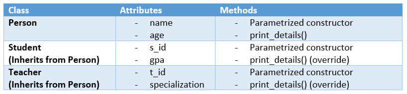

# Task 1: Registration of Students and Teachers

Using OOP, we would like to create a simple registration system for teachers and students at DCI.

**Classes:**




In the file [`src/task_1.py`](src/task_1.py), define the classes `Person`, `Student` and `Teacher` so that:
  
- [ ] The constructors must define the attirbutes above in the order described. Note that:
	* `name` and `age` are self-explanatory.
	* `s_id` and `t_id` correspond to the student and the teacher ids respectively.
	* `gpa` is the student's grade average.
	* `specialization` is the specialization of the teacher.
	
- [ ] The method `print_details()` prints all the details of the object. You have the freedom of printing them in the way you see fit.


When you define the classes, you can run a test on your code by launching:
```
python src/test_1.py
```
