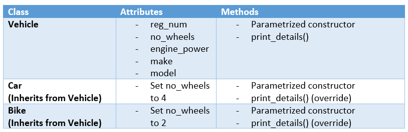

# Task 2: OOP with Vehicles

Using OOP, we would like to model different types of vehicles.

**Classes:**



In the file [`src/task_2.py`](src/task_2.py), define the classes `Vehicle`, `Car` and `Bike` so that:
  
- [ ] The constructors must define the attributes above in the order described. Note that:
	* `reg_num`, `num_wheels`, `engine_power`, `model` and `make` are all self-explanatory.
	* In the constructor of the class `Car`, `num_wheels`must be set to 4.
	* In the constructor of the class `Bike`, `num_wheels`must be set to 2.
	
- [ ] The method `print_details()` prints all the details of the object. You have the freedom of printing them in the way you see fit.


When the classes are defined, you can run a test on your code by launching:
```
python src/test_2.py
```
