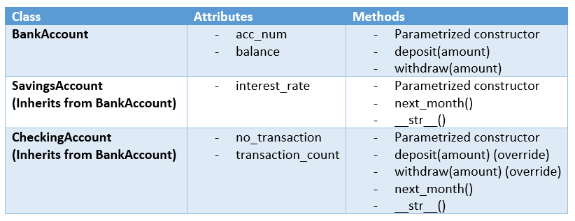

# Task 3: Simple Banking App

Using OOP, we would like to create a simple app for creating bank accounts.

### Classes:



### To do:
In the file [`src/task_3.py`](src/task_3.py), define the classes `BankAccount`, `SavingsAccount` and `CheckingAccount` so that:
  
- [ ] The constructors must define the attributes above in the order described. Note that:
	* `acc_num` is the account number.
	* `balance` is the current balance.
	* `interest_rate` is self-explanatory.
	* `no_transcation` is the maximum number of transaction allowed in one month.
	* `transaction_count` corresponds to the number of transaction done in the current month.
	
	
- [ ] The method `deposit(amount)` adds the amount `amount` to the balance of the account:
	* In the class `CheckingAccount`, whenever `depost(amount)` is executed **successfully**, the `transaction_count` is incremented.
		* If `no_transcation` is reached, no more `deposit(amount)` is allowed during the current month.
	

- [ ] The method `withdraw(amount)` subtracts the amount `amount` from the balance of the account:
	* In the class `CheckingAccount`, whenever `withdraw(amount)` is executed **successfully**, the `transaction_count` is incremented.
		* If `no_transcation` is reached, no more `withdraw(amount)` is allowed during the current month.
	
- [ ] The method `next_month()` is to be called at the beginning of each month:
	* In `CheckingAccount`, it resets the `transaction_count`to 0.
	* In `SavingsAccount`, it calculates the interest based on `balance` and `interest_rate`. Then it adds it to `balance`.

- [ ] The method `__str__()` returns a string representation of the objects of the classes `CheckingAccount` and `SavingsAccount`.

When you define the classes, you can run a test on your code by launching:
```
python src/test_3.py
```
