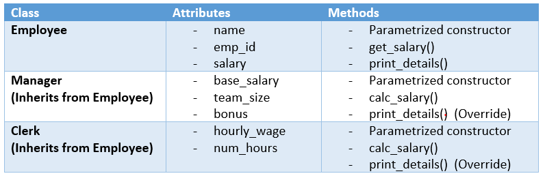

# Task 4: Employee

Using OOP, we would like to create a simple app for managing employees salaries.

### Classes:



### To do:
In the file [`src/task_4.py`](src/task_4.py), define the classes `Employee`, `Manager` and `Clerk` so that:
  
- [ ] The constructors must define the attributes above in the order described. Note that:
	* `name` is the name of the employee.
	* `emp_id` is the id of the employee.
	* `salary` is the salary of the employee.
	* For the `Manager` class, the salary is calculated by multiplying the `team_size` by `bonus` and adding the `base_salary`.
	* For the `Clerk` class, the salary is calculated by multiplying the `hourly_wage` by `num_hours`.
	
	
- [ ] The method `get_salary()` is a getter that returns the attribute `salary`.


- [ ] The method `print_details()` prints the information of the object (it prints the attributes).
	

- [ ] The method `calc_salary()` calculates the salary in the classes `Manager` and `Clerk`, and updates the attribute `salary`.

When you define the classes, you can run a test on your code by launching:
```
python src/test_4.py
```
